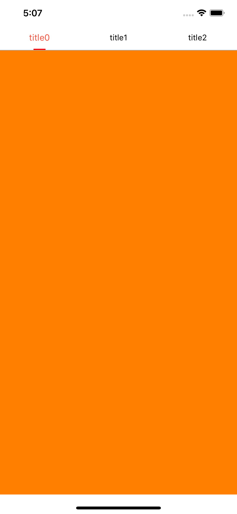

# MHTabController

[](https://travis-ci.org/薛明浩/MHTabController)
[](https://cocoapods.org/pods/MHTabController)
[](https://cocoapods.org/pods/MHTabController)
[](https://cocoapods.org/pods/MHTabController)

## Screenshots

<p align="center">

<br/>
demo
</p>

## Feature

1. Switch sub-viewcontrollers by swipe gesture.
2. Switch sub-viewcontrollers by button click.
3. A bar show titles of sub-viewcontrolles.
4. Badge support.
```
- (MHTabItemBadge *)badgeModelForItemAtIndex:(NSUInteger)index;
```
5. Set default page index.
```
- (NSUInteger)defaultTabIndex;
```

## Example

To run the example project, clone the repo, and run `pod install` from the Example directory first.

## Requirements

## Installation

MHTabController is available through [CocoaPods](https://cocoapods.org). To install
it, simply add the following line to your Podfile:

```ruby
pod 'MHTabController', :git => 'git@github.com:Minghao2017/MHTabController.git'
```

## Author

薛明浩, xue_minghao@qq.com

## License

MHTabController is available under the MIT license. See the LICENSE file for more info.
